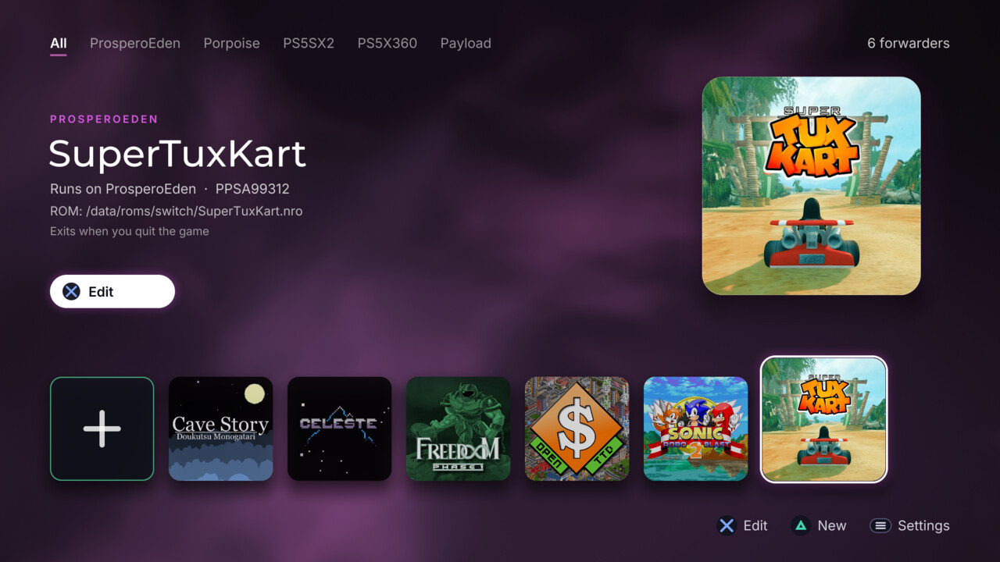
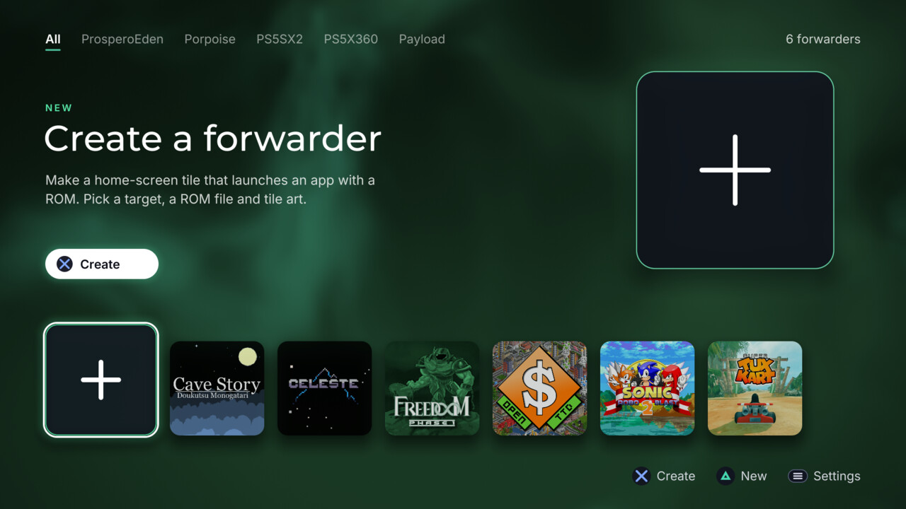
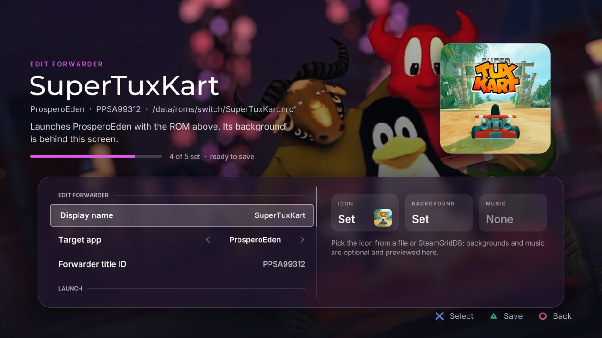
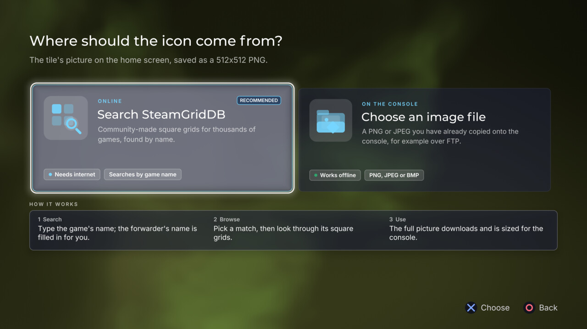
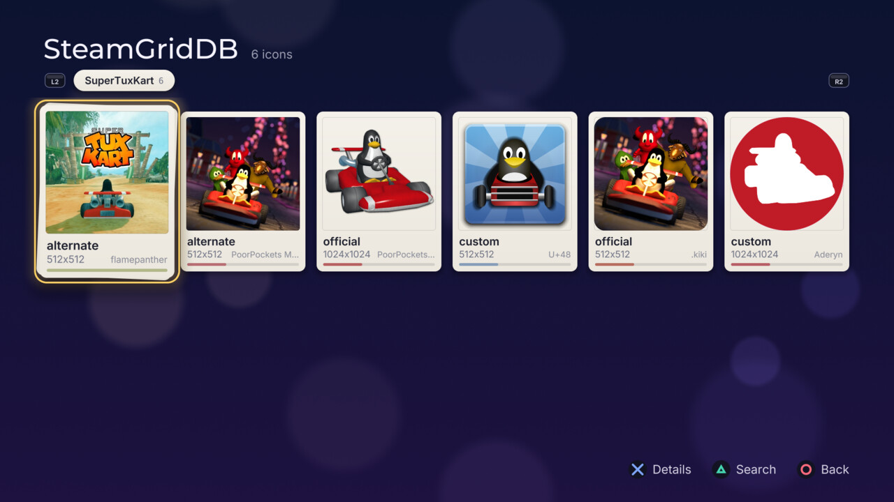

# Forwarder Manager

A native PlayStation 5 homebrew app that creates and edits home-screen
**forwarders**: tiles that launch another installed app (an emulator) with
launch arguments such as `--rom <file>`. It is a native port of the web tool
[ps5-forwarder.mph.am](https://ps5-forwarder.mph.am/) by Martin Pham, rewritten
from scratch to run on the console itself.



| | |
| --- | --- |
|  |  |
|  |  |
|  | |

The screenshots use demo forwarders for freeware and open-source games.

## What it does

- Lists the forwarders already in `/data/homebrew` and lets you edit or delete them.
- Creates a new forwarder: display name, target app, title ID, ROM file, an
  `--exit-after-game` flag, and launch arguments.
- Picks the ROM (and optional `.at9` music) with a built-in file browser over
  the console filesystem.
- Fetches tile icons and backgrounds from [SteamGridDB](https://www.steamgriddb.com/)
  or from any image file, encoding them to the exact
  formats the PS5 shell expects: a 512x512 PNG icon and 3840x2160 BC7 DDS
  backgrounds.
- Writes a complete tile folder (shared `eboot.bin` + `libc.prx`,
  `forwarder.json`, `sce_sys/param.json`, art) that ShadowMountPlus registers.

## Install

1. Download `PPSA99930.zip` from the latest
   [release](https://github.com/heydemoura/ps5-forwarder-manager/releases)
   (`SHA256SUMS` next to it has its checksum).
2. Unzip it and copy the `PPSA99930` folder to `/data/homebrew/` on the
   console, for example over FTP.
3. Let ShadowMountPlus register it, then start **Forwarder Manager** from the
   home screen.

To update, replace the folder with the one from a newer release. Your
forwarders live in their own folders and are kept.

## Requirements on the console

- A jailbroken PS5 with `elfldr` listening on port 9021.
- [ShadowMountPlus](https://github.com/drakmor/ShadowMountPlus) to register the
  generated tiles.

Nothing else needs to be loaded for the app to reach `/data/homebrew`. The
release bundles the exact-title one-shot helper from
[PS5-Lapy-JB-Daemon](https://github.com/ArkSama/PS5-Lapy-JB-Daemon)
(`lapy.elf`, with its MIT license in `licenses/`). At launch the app first asks
a Lapy daemon that is already running, if there is one; otherwise it hands its
own helper to `elfldr`, which lifts only this app out of its sandbox and then
exits. The app uses `/data` only after it has proved it can write, read and
list it.

Forwarders are made in the [PS5 Forwarder Format](https://github.com/heydemoura/ps5-forwarder-format),
a standard shared with emulators that create forwarders themselves. The format
lives in the `external/ps5-forwarder-format` submodule: its specification, the
`psfwd` library this app reads and writes forwarders with, the forwarder
program every tile runs, and an open-source launcher.

No separate launcher payload is needed. A tile cannot start another app
itself, so it asks a resident launcher on `127.0.0.1:10199`; when none is
running, the tile sends the launcher it carries to `elfldr` first. The app does
the same when it starts, and at each start it gives existing forwarders the
current forwarder program (only folders with a `forwarder.json` whose program
is a forwarder's are touched). A launcher that is already running, such as
ps5-app-launcher, is used as it is. Settings shows which one serves the tiles.

## Building

This repository is built on the
[ps5-native-app-boilerplate](https://github.com/blackbearreloaded/ps5-native-app-boilerplate)
with the [ps5-homebrew-ui](https://github.com/blackbearreloaded/ps5-homebrew-ui)
OpenGL kit. From a Linux or WSL host with Clang 18, lld, Make, Ninja and
Python 3:

```bash
git submodule update --init        # the PS5 Forwarder Format (or clone with --recursive)
make                       # fetches the SDK, ps5-opengl and PacBrew libcurl, then builds
make deploy PS5_HOST=<ip>  # uploads dist/<TITLE_ID>/ to /data/homebrew over FTP
```

The forwarder template and launcher come prebuilt from the format's
`template/` folder. `make standard-template` rebuilds them from the format's
sources inside the submodule; commit the result there.

The build always links PacBrew's libcurl (for the SteamGridDB HTTPS client,
since an elevated app cannot use `sceHttp`). SteamGridDB search needs an API
key built into the app: set `STEAMGRIDDB_API_KEY` in `.env` (see
`.env.example`) or the environment. Release builds get it from the
repository's `STEAMGRIDDB_API_KEY` Actions secret. Without a key the app
still works, with image files only.

## Releases

Versions follow the PlayStation `contentVersion` format, `NN.NNN.NNN`
(`00.001.000` is the first release). To cut one, raise `contentVersion` in
`sce_sys/param.json`, add `docs/release-notes/<version>.md`, commit both, then
push a tag named exactly the version (no `v`). CI builds the app and publishes
a GitHub release with `PPSA99930.zip`, `SHA256SUMS` and those notes.
`docs/catalog/PPSA99930.json` is the record for the
[PS5 Homebrew Catalog](https://github.com/blackbearreloaded/ps5-homebrew-catalog);
update its `version`, `artifact_url`, `sha256` and `icon_url` for each release
(the catalog's daily job can also propose the update).

## Layout

| Path | What |
| --- | --- |
| `src/main.cpp` | Entry point: elevation, then the kit frame loop |
| `src/app/` | The app and its screens (home, edit, file picker, art, SteamGridDB, settings) |
| `src/fwd/` | The forwarder model, the on-disk store, and the icon/DDS image encoders |
| `src/net/` | libcurl glue and the SteamGridDB API v2 client |
| `src/platform/` | Sandbox elevation (Lapy daemon, then the bundled Lapy helper) and app-root resolution |
| `src/{gfx,ui,audio,core,runtime}` | The ps5-homebrew-ui kit |
| `assets/forwarder-template/` | The shared launcher `eboot.bin` and `libc.prx` |

## Development harness

Because the build host has no controller, the app carries a dev-only harness
that is inert unless trigger files exist under `/data/ps5fwdgen-dev/`:

- `input.txt` - a line-per-command script (`up`/`down`/`cross`/`type:<text>`/
  `wait N`/`shot`/`quit`) fed as synthetic input to the real screens, consumed
  once. `shot` saves a 1920x1080 PNG to the app's `download0`.
- `selftest.txt` - runs the real `write_forwarder()` once with test values.

These are read only when present and never affect normal use.

## Acknowledgements

Forwarder Manager could not reach `/data` without
[PS5-Lapy-JB-Daemon](https://github.com/ArkSama/PS5-Lapy-JB-Daemon). Many
thanks to **ArkSama / Team PHU**, who created Lapy and released it as open
source, and to [mpereiraesaa](https://github.com/mpereiraesaa/PS5-Lapy-JB-Daemon)
for the exact-title one-shot helper this app bundles. Thanks as well to the
Lapy contributors, to Martin Pham for
[ps5-forwarder.mph.am](https://ps5-forwarder.mph.am/), and to the authors of
[ShadowMountPlus](https://github.com/drakmor/ShadowMountPlus),
[SteamGridDB](https://www.steamgriddb.com/), the
[ps5-native-app-boilerplate](https://github.com/blackbearreloaded/ps5-native-app-boilerplate)
and the [PS5 payload SDK](https://github.com/ps5-payload-dev/sdk).

Licensed GPL-3.0-or-later. Lapy's helper is MIT licensed (see
`licenses/Lapy-MIT.txt` in the release). See `THIRD_PARTY_NOTICES.md`.
