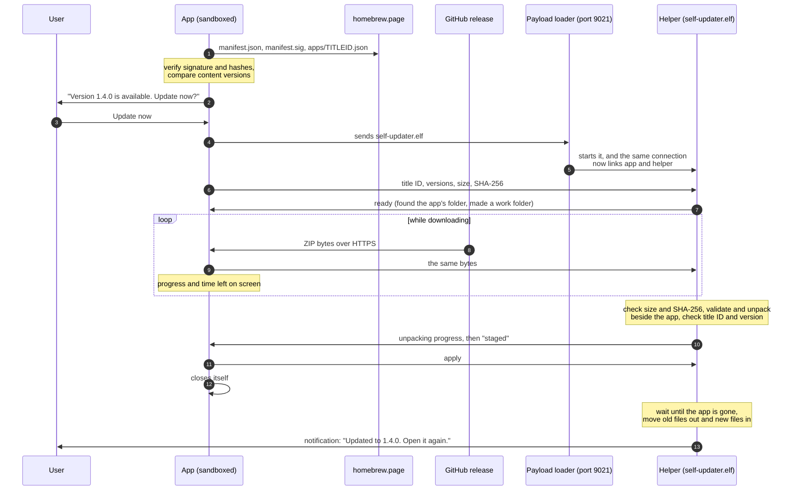

# Self-update

An app listed on [homebrew.page](https://homebrew.page) can replace itself
with its newest release: it asks its user, downloads the release, and a small
helper program puts the new version in place once the app has closed. This
optional example is that feature: an engine you copy into your project, the
helper it ships with, and an example title.

It builds on the [update check](UPDATE_CHECK.md), which only tells the user
that a newer release exists. Use that one if telling is enough.

> **Status.** Run on a PS5 on 2026-10-03: the example title updated itself
> from one version to the next and the new version started
> ([Console validation](#console-validation)). The same section lists what that
> run did not cover.

## What the user sees

1. The app starts and checks the catalog in the background.
2. If a newer release is listed: **"Update available. Version 1.4.0. Update
   now / Later."**
3. On "Update now": a progress bar with the amount downloaded and the time
   left ("about 20 s left"), then the same for unpacking. It can be cancelled
   at any point; nothing has been changed yet.
4. "Updating. The app closes now." The app closes itself.
5. A few seconds later a system notification: **"My App was updated to 1.4.0.
   Open it again."**

If no payload loader is running on the console, step 3 fails at once with a
clear reason and the app is untouched; it can still tell the user about the
update, as the update check does.

## How it works



Two programs take part, and each does only what it can do well.

| | The app (sandboxed) | The helper (`self-updater.elf`) |
| --- | --- | --- |
| Runs | In its normal sandbox, as always | Outside the sandbox, started by the console's payload loader |
| Does | Asks the catalog and verifies it; asks the user; downloads the release over HTTPS; shows progress | Saves the download; checks and unpacks it; waits for the app to close; replaces the app's files; refreshes the home-screen copies; posts the notification |
| Why here | It has the screen and a working HTTPS client | An app can't write to its own folder, and the console slows an app's file writes to about 2 MB/s after a few hundred megabytes; a loader-started process has neither limit |

The app sends the helper to the payload loader on loopback port 9021, the same
way the loader receives any payload. The connection the helper was sent over
then carries their conversation
([`self_update_protocol.h`](../examples/self-update/self_update_protocol.h)):
the app streams the archive to the helper as it downloads it, the helper
reports its progress, and at the end the app says `apply` and closes.

The helper never elevates the app and never touches the kernel. It is an
ordinary program doing file work with the rights every payload has.

### The steps

1. **Check.** `self_update_check_self()` fetches the catalog's `manifest.json`
   and its signature, verifies the signature, then fetches the app's own file
   and requires its SHA-256 to be the one the manifest lists. Only then does it
   believe the release's address, size and SHA-256.
2. **Ask.** Your interface asks the user.
3. **Start.** `self_update_start()` starts the helper. The helper finds the
   app's installed folder, checks that it holds the version that is running,
   and makes its work folder on the same drive
   (`<drive>/self-update/<TITLEID>/`).
4. **Download.** The app downloads the ZIP from GitHub and streams it to the
   helper, hashing it on the way.
5. **Stage.** The helper checks size and SHA-256 again, validates the archive
   (paths, links, sizes, one app only) and unpacks it beside the app. The
   unpacked app must name the same title ID and the version the catalog
   listed. Its files are given mode 0777, as files copied to the console have:
   with anything less the console refuses to start the app.
6. **Apply.** `self_update_apply()` gives the go-ahead and the app closes
   itself. The helper waits until the app's sandbox is gone, then moves the
   app's files out and the new ones in (renames on the same drive), refreshes
   the console's copies of `sce_sys`, removes its work folder and posts the
   notification.

The app's folder itself stays where it is, so the console's existing mount of
it keeps pointing at the right place and the next launch reads the new files.

## Use it in your app

The short version; [Examples](#examples) has the complete code and the build
steps spelled out.

1. Copy the kits into your sources:

   ```bash
   cp examples/update-check/{update_check,console_curl}.{h,c} src/
   cp examples/self-update/self_update*.{h,c} src/
   ```

2. Build the helper and ship it in the app's folder, and link libcurl, in the
   `Makefile`:

   ```make
   PACBREW_PACKAGES += libcurl
   APP_WRAP_SYMBOLS += fcntl
   APP_ROOT_FILES += build/self-update/self-updater.elf

   app ffpkg ffpfsc packages: self-update-helper
   ```

   `make self-update-helper` builds `build/self-update/self-updater.elf` from
   [`examples/self-update-helper/`](../examples/self-update-helper) and checks
   that the loader will accept it. The helper is the same for every app: it
   takes the title ID from the request.

3. Keep `downloadDataSize` positive in `sce_sys/param.json` (the template's
   default): the kit keeps one number in `/download0`.

4. Drive it from your interface. Nothing here may run on the thread that
   draws, except `self_update_poll`:

   ```cpp
   #include "self_update.h"

   static self_update_offer offer;
   static self_update_job job;   // zero-initialised

   // On a worker thread, once per launch:
   if (self_update_check_self(&offer) == SELF_UPDATE_AVAILABLE)
       ask_user("Version %s is available. Update now?", offer.version);
   // offer.notes holds the release notes, when the release has any: show them
   // before the user decides (see "Showing what's new").

   // When the user says yes:
   self_update_start(&job, self_update_console(), &offer);

   // Every frame while it runs:
   self_update_status status;
   self_update_poll(&job, &status);
   // status.phase, status.done, status.total, status.time_left, status.error
   if (status.phase == SELF_UPDATE_READY && self_update_apply(&job) == 1)
   {
       show("Updating. The app closes now.");
       sceSystemServiceLoadExec("exit", nullptr);   // close the app
   }

   // To cancel (any time before apply): self_update_cancel(&job);
   // After FAILED or CANCELLED: self_update_finish(&job);
   ```

5. Release as the catalog asks: a `.zip` of the app folder attached to a
   GitHub release, and a higher `contentVersion` in `sce_sys/param.json`
   ([App versions](https://github.com/blackbearreloaded/ps5-homebrew-catalog/blob/main/docs/versioning.md)).
   The helper is part of that ZIP, so each release carries its own.

## Examples

### A complete integration

Everything an app needs, with the interface left as four functions of your own
(`show_offer`, `show_progress`, `show_message`, `button_pressed`). The check
and the update run on their own threads; the frame function only reads their
state.

```cpp
#include "self_update.h"

#include <atomic>
#include <pthread.h>

extern "C" int sceSystemServiceLoadExec(const char *path, const char **arguments);

enum class UpdateUi { hidden, offer, working, closing, failed };

static self_update_offer offer;          // filled by the check
static self_update_job job;              // zero-initialised; one update at a time
static std::atomic<int> check_result{-1}; // -1 while the check runs
static UpdateUi ui = UpdateUi::hidden;
static char failure[160];

static void *check_thread(void *)
{
    check_result.store(self_update_check_self(&offer));   // blocks on the network
    return nullptr;
}

// Once, at start-up.
void update_begin()
{
    pthread_t thread;
    if (pthread_create(&thread, nullptr, check_thread, nullptr) == 0)
        pthread_detach(thread);
}

// Every frame, from the thread that draws.
void update_frame()
{
    if (ui == UpdateUi::hidden && check_result.load() == SELF_UPDATE_AVAILABLE)
    {
        check_result.store(-1);   // offer once
        ui = UpdateUi::offer;
    }

    if (ui == UpdateUi::offer)
    {
        show_offer(offer.name, offer.version, offer.size);   // "Update now" / "Later"
        if (button_pressed(Button::confirm) &&
            self_update_start(&job, self_update_console(), &offer) == 1)
            ui = UpdateUi::working;
        else if (button_pressed(Button::back))
            ui = UpdateUi::hidden;
    }
    else if (ui == UpdateUi::working)
    {
        self_update_status status;
        self_update_poll(&job, &status);
        show_progress(status.phase, status.done, status.total, status.time_left);

        if (status.phase == SELF_UPDATE_READY)
        {
            // Staged and verified. Save the user's state, then give the go-ahead.
            if (self_update_apply(&job) == 1)
                ui = UpdateUi::closing;
        }
        else if (status.phase == SELF_UPDATE_FAILED || status.phase == SELF_UPDATE_CANCELLED)
        {
            snprintf(failure, sizeof(failure), "%s",
                     status.phase == SELF_UPDATE_CANCELLED ? "Update cancelled" : status.error);
            self_update_finish(&job);   // the job can be started again later
            ui = UpdateUi::failed;
        }
        else if (button_pressed(Button::back))
            self_update_cancel(&job);   // CANCELLED arrives through self_update_poll
    }
    else if (ui == UpdateUi::closing)
    {
        show_message("Updating. The app closes now.");
        sceSystemServiceLoadExec("exit", nullptr);   // the helper takes over from here
    }
    else if (ui == UpdateUi::failed)
    {
        show_message(failure);   // nothing was changed
        if (button_pressed(Button::confirm))
            ui = UpdateUi::hidden;
    }
}
```

The example title
([`examples/self-update/src/main.cpp`](../examples/self-update/src/main.cpp))
is this same flow with real drawing and controller code, and is what ran on
the console.

### Showing progress

`self_update_poll` gives everything a progress view needs:

```cpp
self_update_status status;
self_update_poll(&job, &status);

const char *title = status.phase == SELF_UPDATE_DOWNLOADING ? "Downloading"
                  : status.phase == SELF_UPDATE_UNPACKING   ? "Unpacking"
                  : status.phase == SELF_UPDATE_READY       ? "Finishing"
                                                             : "Preparing";
float fraction = status.total != 0 ? (float)status.done / (float)status.total : 0.0f;
// status.total is 0 until it is known: draw an indeterminate bar then.
// status.time_left is "about 20 s left", "a few seconds left", or empty.
// status.rate is bytes per second, smoothed, if you want to show a speed.
```

What the example title logged on the console, one line a second, shows the
values over a real update:

```text
phase=starting    done=0        total=0         left=-
phase=downloading done=2915799  total=13184595  left=a few seconds left
phase=downloading done=7405015  total=13184595  left=a few seconds left
phase=downloading done=11910615 total=13184595  left=a few seconds left
phase=unpacking   done=0        total=0         left=-
phase=ready       done=26536616 total=26536616  left=-
```

### Showing what's new

The catalog publishes what the developer wrote on the release
([`release_notes`](https://github.com/blackbearreloaded/ps5-homebrew-catalog/blob/main/docs/api.md#release-notes)),
and the check copies it into the offer. It is part of the app's catalog file,
so the same signature covers it. Let the user read it before choosing:

| Field | Holds |
| --- | --- |
| `offer.notes` | Plain UTF-8 text, at most 4,000 characters: lines split by `\n`, list items starting with `- `, a blank line before each heading or paragraph. Empty when the release has no notes |
| `offer.notes_truncated` | 1 when the catalog cut the notes; the rest is on the release's page (`offer.page` leads there) |

No Markdown or HTML parser is needed. Split on `\n` and decide per line:

```cpp
// One entry per line of the notes: what it is, and its text.
enum class NoteKind { gap, bullet, heading, callout, text };
struct NoteLine { NoteKind kind; std::string_view text; };

std::vector<NoteLine> note_lines(std::string_view notes)
{
    std::vector<NoteLine> lines;
    for (std::size_t at = 0; at <= notes.size();)
    {
        const std::size_t end = std::min(notes.find('\n', at), notes.size());
        std::string_view line = notes.substr(at, end - at);
        at = end + 1;
        const auto starts = [&](std::string_view prefix) { return line.substr(0, prefix.size()) == prefix; };
        if (line.empty())
            lines.push_back({NoteKind::gap, {}});
        else if (starts("- "))
            lines.push_back({NoteKind::bullet, line.substr(2)});
        // The catalog turns GitHub's "> [!WARNING]" boxes into "Warning: ...".
        else if (starts("Warning:") || starts("Caution:") || starts("Important:") || starts("Note:") || starts("Tip:"))
            lines.push_back({NoteKind::callout, line});
        // A short line without closing punctuation reads as a heading.
        else if (line.size() <= 48 && std::string_view(".:!?,;)").find(line.back()) == std::string_view::npos)
            lines.push_back({NoteKind::heading, line});
        else
            lines.push_back({NoteKind::text, line});
    }
    return lines;
}
```

Then wrap each line to your text column and draw it in a scrolling area. What
works well on a TV, from ProsperoEden's dialog
([`update.cpp`](https://github.com/blackbearreloaded/ProsperoEden/blob/main/headless/prosperoeden/pe/ui/update.cpp),
which you can read as a complete implementation):

- Put a **What's new** button between **Update now** and **Skip** only when
  `offer.notes[0] != '\0'`, and open the notes in a view of their own with
  **Update now** and **Back** under the text.
- Scroll a few lines per press and a page on L1/R1; show a scrollbar and fade
  the text where more is above or below.
- Break a word that is wider than the column between whole characters (links,
  and text in languages without spaces).
- Show the notes as the developer wrote them. They are the developer's words
  in the developer's language: translate your dialog, not the notes.
- When `offer.notes_truncated` is set, end with a line saying the rest is on
  the app's page.

### An app that has filesystem access

An app that leaves its sandbox ([Sandbox elevation](SANDBOX_ELEVATION.md)), or
that ShadowMountPlus 1.7 gives `/data` and the drives to, may not have `/app0`
and `/download0` where the kit expects them, and may be installed anywhere
ShadowMountPlus mounts from (a USB drive, extended storage, its manual list).
Two things follow.

**Find the app's own files at the console's mount of the running app**, not at
one install folder. `/system_ex/app/<TITLEID>` is where the console mounts the
app it runs, whatever the source:

```cpp
// The app's own folder: /app0 while it is mounted, else the console's mount of
// the running app, else the usual install folder.
const std::string &app_dir()
{
    static const std::string directory = [] {
        for (const char *candidate : {"/app0", "/system_ex/app/PPSA12345", "/data/homebrew/PPSA12345"})
            if (file_exists(std::string(candidate) + "/eboot.bin"))
                return std::string(candidate);
        return std::string("/app0");
    }();
    return directory;
}
```

A fixed `/data/homebrew/<TITLEID>` is not enough: an app copied to
`/mnt/usb0/homebrew` found none of its files there and closed at start, on
firmware 4.50 and 13.60 (ProsperoEden 1.000.060; fixed in 1.000.070 with the
function above).

**Tell the kit where its three files are.** `self_update_ps5.c` takes them
from these definitions when they are set, and they may be function calls:

```cmake
# CMake; with a Makefile, the same -D flags.
target_compile_definitions(my-app PRIVATE
    "SELF_UPDATE_HELPER_PATH=my_update_path(0)"     # <app folder>/self-updater.elf
    "SELF_UPDATE_PARAM_PATH=my_update_path(1)"      # <app folder>/sce_sys/param.json
    "SELF_UPDATE_SEQUENCE_PATH=my_update_path(2)")  # a file in your data folder
```

```cpp
extern "C" const char *my_update_path(int which)
{
    static const std::string helper = app_dir() + "/self-updater.elf";
    static const std::string param = app_dir() + "/sce_sys/param.json";
    static const std::string sequence = data_dir() + "/self-update-sequence";
    return which == 0 ? helper.c_str() : which == 1 ? param.c_str() : sequence.c_str();
}
```

Compile `self_update_ps5.c` with a header that declares `my_update_path`
(`-include my_paths.h`).

The helper needs nothing: it finds the folder to update itself (see
[What it needs on the console](#what-it-needs-on-the-console)).

### Adding it to an app built from this template

```bash
# 1. The kits (the update check, libcurl support, the self-update engine).
cp examples/update-check/{update_check,console_curl}.{h,c} src/
cp examples/self-update/self_update*.{h,c} src/
```

```make
# 2. In the Makefile, before the targets: link libcurl, ship the helper.
PACBREW_PACKAGES += libcurl
APP_WRAP_SYMBOLS += fcntl
APP_ROOT_FILES += build/self-update/self-updater.elf

# 3. At the end of the Makefile: build the helper before the app is packaged.
app ffpkg ffpfsc packages: self-update-helper
```

```bash
# 4. Build and check that the helper is in the package.
make
unzip -l dist/PPSA12345.zip | grep self-updater.elf
```

Then add the code from [A complete integration](#a-complete-integration) and
draw the four views with your interface.

### Publishing an update

Nothing changes in how you release; the catalog does the rest.

1. Raise `contentVersion` in `sce_sys/param.json` (`01.000.070` to
   `01.000.080`) and commit it.
2. `make`, which builds `dist/<TITLEID>.zip` with the app folder at the top
   and the helper inside.
3. Publish a GitHub release tagged with the version and attach that ZIP.
4. The catalog's update job proposes the new release; once it is merged, the
   catalog lists the new `content_version`, address and SHA-256.

From then on, every installed copy that is older offers the update at its next
start. For a copy installed as an image, or on a console with no payload
loader, `self_update_start` ends in `SELF_UPDATE_FAILED` with the reason;
tell that user about the update instead (`offer.version`, `offer.page`).

### Trying it before your app is listed

The check needs a catalog listing. To try the download, the helper and the
replacement without one, the example title can take its offer from a file.
This skips the catalog's signature, so it is for development only.

1. Build the *new* version: raise `contentVersion`, `make
   self-update-example`, and attach `dist/PPSA99782.zip` to a GitHub release
   (a pre-release in a test repository is enough). Note its size and SHA-256
   (`sha256sum dist/PPSA99782.zip`).
2. Build the *old* version with the offer in its assets:

   ```text
   01.000.010
   1.1.0 test
   https://github.com/<you>/<repository>/releases/download/<tag>/PPSA99782.zip
   ec361bd2309e37b7ef1a5cb29316b95ecbf4763f8af012cbc703b59df1385dd6
   13184595
   ```

   saved as `examples/self-update/assets/offer.txt` (new content version, version name, address,
   SHA-256, size), and:

   ```bash
   APP_DEFINITIONS="SELF_UPDATE_DEV_OFFER" make self-update-example
   ```

3. Install the old version, start it, press Cross on the offer, and start it
   again after the notification: its first log line shows the new build.

This is how the [console validation](#console-validation) was done.

### What the app and the helper say to each other

One update, as it goes over the connection (`>` app to helper, `<` helper to
app):

```text
> PSU1
> update
> PPSA12345
> 01.000.070                  installed content version
> 01.000.080                  new content version
> 36383357                    size in bytes
> 1fece5044d64...a57e80a      SHA-256 of the ZIP
> My App                      name, for the notification
> 1.4.0                       version name, for the notification
< ready
> (the ZIP, in pieces of up to 1 MiB, each with a 4-byte length; a zero length ends)
< p 1048576 52428800          bytes unpacked, bytes to unpack
< p 31457280 52428800
< staged
> apply
< applying
  (the app closes; the helper replaces the files and posts the notification)
```

If the connection ends before `apply`, or the app sends `cancel`, the helper
removes everything it wrote. A refusal is one line, for example
`fail The download doesn't match the catalog's listing`, which the app shows as
`status.error`.

## Reference

### The states

| `status.phase` | Meaning | Show |
| --- | --- | --- |
| `SELF_UPDATE_STARTING` | Starting the helper | "Preparing" |
| `SELF_UPDATE_DOWNLOADING` | `done`/`total` are bytes of the archive | Progress, `time_left`, Cancel |
| `SELF_UPDATE_UNPACKING` | `done`/`total` are bytes unpacked | Progress, `time_left`, Cancel |
| `SELF_UPDATE_READY` | Staged. Call `self_update_apply()` or `self_update_cancel()` | |
| `SELF_UPDATE_APPLYING` | The helper has the go-ahead | "The app closes now", then close |
| `SELF_UPDATE_CANCELLED` | Stopped on request; nothing was changed | |
| `SELF_UPDATE_FAILED` | `error` says why; nothing was changed | The reason |

| `self_update_check_self()` | Meaning | What to do |
| --- | --- | --- |
| `SELF_UPDATE_AVAILABLE` | The offer is filled and verified | Ask the user |
| `SELF_UPDATE_UP_TO_DATE` | Nothing newer | Nothing |
| `SELF_UPDATE_UNKNOWN` | No answer, or the app isn't listed | Nothing |
| `SELF_UPDATE_UNTRUSTED` | The signature, the sequence or a hash didn't verify | Nothing; log it |
| `SELF_UPDATE_NOT_INSTALLABLE` | Newer, but not a ZIP on GitHub with a digest | Tell the user, as the update check does (`offer.version`, `offer.page`) |

### Rules

- **Always ask.** Never update without the user's yes, and never during
  something they would lose.
- **Never on the thread that draws**, except `self_update_poll`.
- **After `self_update_apply()` returns 1, close the app at once.** The helper
  waits two minutes for it; then it gives up, removes its work and says so in
  a notification.
- **One update at a time**, and one check at a time: the kit isn't reentrant.
- **Save the user's state before closing.** `/download0` isn't touched by an
  update. At the app folder's top level, entries present in the release replace
  entries of the same name; entries absent from the release are preserved.

## What it needs on the console

| Need | Why | Without it |
| --- | --- | --- |
| A payload loader listening on port 9021 | It starts the helper | `SELF_UPDATE_FAILED`: "The update helper couldn't be started. Is the payload loader running?" Nothing is changed |
| The app installed as a **folder** | The helper replaces files in that folder. It takes the folder ShadowMountPlus mounted the app from (`/user/app/<TITLEID>/mount.lnk`: any scan path, or its manual list); without that record it looks in the usual places (`/data/homebrew`, `/data/etaHEN/games`, the same on `/mnt/ext0`, `/mnt/ext1`, `/mnt/usb0`-`7`, or an external drive's root) | Installed as an image (`mount_img.lnk`): "The app is installed as an image; update it by replacing the image". Not found: "The app's folder wasn't found. Apps installed as an image can't update themselves" |
| The installed folder at the running version; without ShadowMountPlus's record, exactly one installed copy | So the right files are replaced | A refusal that says which it was |
| Free space on the app's drive for the ZIP and the unpacked app together | Staging happens before anything is replaced | A refusal before the download, or before unpacking |
| The app listed in the catalog as a ZIP | The check | `SELF_UPDATE_UNKNOWN` or `SELF_UPDATE_NOT_INSTALLABLE` |

## Trust

Updating means installing code, so every link is checked:

| What | Checked by | Against |
| --- | --- | --- |
| The catalog's manifest | The app | An Ed25519 signature from one of the catalog's two keys, which the kit carries |
| A replayed old catalog | The app | The manifest's sequence number may never go below the highest one accepted (kept in `/download0/self-update-sequence`) |
| The app's own catalog file | The app | Its SHA-256 in the signed manifest |
| The download's source | The app | Only `https://github.com/`, and GitHub's own release file host after a redirect |
| The download | The app, then the helper again | The size and SHA-256 in the app's catalog file |
| The archive's contents | The helper | No absolute or parent paths, links, special files, encryption or duplicates; one app; bounded sizes |
| What was unpacked | The helper | `sce_sys/param.json` must name this title ID and the listed version |
| What is replaced | The helper | Only top-level entries supplied by the release, inside the one installed folder whose `param.json` names this title ID at the running version |

HTTPS certificates are verified throughout (see [libcurl](CURL.md)). What the
kit does not defend against: the developer's own release being malicious, or
the developer's GitHub account being taken over before the catalog's update
is reviewed. The catalog lists exactly one file by its hash; a release asset
replaced afterwards no longer matches and is refused.

The helper is as powerful as any payload: whoever can reach the loader's port
can already run anything. It still refuses requests that aren't a title ID,
versions and a digest, and it writes only inside the app's folder, its own
work folder and the console's `sce_sys` copies for that title.

## If something goes wrong

| When | What happens |
| --- | --- |
| The download fails, doesn't match, or is cancelled | The helper removes its work folder. The app is untouched |
| The archive is refused, or isn't the listed version | The same |
| The app doesn't close within two minutes of `apply` | The helper removes its work and notifies: "wasn't updated: it didn't close" |
| A file can't be moved while replacing | The moves made so far are undone and the app is as it was; a notification says so |
| The console loses power **during** the replacement | The one unprotected moment: the app's folder may be incomplete, and the app must be installed again. The replacement is a handful of renames, a fraction of a second |
| The console loses power at any other time | A leftover `<drive>/self-update/<TITLEID>/` folder, removed by the next update attempt |

## The example title

`make self-update-example` builds `dist/PPSA99782/`, a title that checks
itself and draws the prompt and the progress with the template's CPU renderer
(Cross: update now; Circle: later, or cancel). It writes every step to the
kernel log and to `/download0/self-update.txt`, each line starting
`SELF-UPDATE:`.

Its title ID isn't in the catalog, so as built it reports "No update
information". Build definitions, for trying it and for scripted console runs:

| Definition | Effect |
| --- | --- |
| `SELF_UPDATE_RUN_TAG=<word>` | Printed in the first line, to tell runs apart |
| `SELF_UPDATE_DEV_OFFER` | **Development only.** Takes the offer from `/app0/assets/offer.txt` (five lines: new content version, version name, release ZIP on GitHub, SHA-256, size; any further lines are the release notes) instead of the catalog. It skips the catalog's signature: never ship a build with it |
| `SELF_UPDATE_AUTO_ACCEPT=<seconds>` | Accepts the offer after that long, as if Cross had been pressed |
| `SELF_UPDATE_EXIT_AFTER=<seconds>` | Closes the title that long after it has nothing more to do |
| `SELF_UPDATE_WATCHDOG=<seconds>` | Closes the title that long after it started, whatever else happens, so a scripted run never leaves it open |

An app with a real interface draws its own prompt from the same values. For a
dialog and progress view in the style of ProsperoStore, see
[ps5-homebrew-ui](USER_INTERFACE.md).

## Tests

```bash
make test-self-update
```

Builds the engine and the helper's code into one host test, with the address
and undefined-behaviour sanitizers, and runs them against each other over a
socket pair with real ZIP archives and real folders:

- the check: a valid catalog, an old sequence, a bad or short signature, a
  changed app file, an app that isn't listed, a release that isn't a ZIP or
  isn't on GitHub;
- a whole update, including that nothing is replaced while the app's sandbox
  exists, and that the old files, the work folder and the console's `sce_sys`
  copies end up right, while an unlisted top-level user file is preserved;
- refusals: a download that doesn't match, a connection that drops, an archive
  holding another version or another app, an installed copy at another
  version, two installed copies, no payload loader;
- cancelling once staged, and an app that never closes;
- the replacement undone when a file can't be moved; SHA-256 against the
  standard's test values; the time-left wording; the address rules.

The host test replaces the network, the Ed25519 check and the payload loader.

## Console validation

The current implementation was exercised end to end on firmware 6.02 and
12.70 on 2026-10-04. Both consoles used the same development A build at
`01.000.000` (`eboot.bin` SHA-256
`9fa499fd4a5e941609680d463aa71fd605da3a1a5f88107c3a7e6b0d346c8be7`) and
downloaded the same 13,185,594-byte B release at `01.000.010` (ZIP SHA-256
`54c312c7f2f3340068a2c9c65bb1f8f8d3e204dd610e1312aa37fbfaba49a810`,
`eboot.bin` SHA-256
`f296b5df5202959a91108acb5d7dbe4d5a1f10cfe0d55b7021bfdc7aabd80243`).

On each console the automated run checked all of the following:

| Checked | Result |
| --- | --- |
| GitHub download, advertised size and SHA-256 | Passed |
| Staging, version/title validation, app close and helper replacement | Passed |
| Every packaged B file after installation | All 9 files matched the release |
| Unlisted top-level `user-note.txt` | Preserved byte-for-byte |
| Work-folder cleanup | Passed |
| Immediate B relaunch | Reported `refresh_b`, then closed normally |
| Kernel log and console services | No panic/crash signatures; FTP, kernel log and elfldr responsive |

The fixture uses `SELF_UPDATE_DEV_OFFER`, so this is a validation of the
release download, integrity, staging and replacement path. Catalog signature
verification remains covered by the host tests described above.

ProsperoEden, which uses this kit, has since exercised two things the fixture
does not: the **signed catalog check on a console** (firmware 6.02, 2026-10-05:
homebrew.page offered 1.000.070 with its release notes to a build reporting
1.000.060), and an **install on a USB drive** (`/mnt/usb0/homebrew`, firmware
4.50 and 13.60, confirmed by the testers who reported it). Not yet run on a
console: the helper taking its folder from `mount.lnk`, and its refusal of an
image install; both are covered by the host tests.

### Earlier single-console run

Run on a PS5 on 2026-10-03 with the example title installed as a folder under
`/data/homebrew` and registered by ShadowMountPlus. The console's firmware
version wasn't recorded. Two builds of the example were used: build A at
content version `01.000.000` (`eboot.bin` SHA-256
`4d9587478f0fc0e7c7eeaf43f05b479b366ec7bcb0bcbff64a2ed41a2ff49c5b`, built with
`SELF_UPDATE_DEV_OFFER`, `SELF_UPDATE_AUTO_ACCEPT=5` and a watchdog), and build
B at `01.000.010`, a 13.2 MB ZIP attached to a GitHub release (SHA-256
`ec361bd2309e37b7ef1a5cb29316b95ecbf4763f8af012cbc703b59df1385dd6`).

Build A's report, then build B's after the title was started again:

```text
SELF-UPDATE: start tag=a3
SELF-UPDATE: DEVELOPMENT OFFER: the catalog and its signature are skipped
SELF-UPDATE: controller ready
SELF-UPDATE: check result=available installed=01.000.000 available=01.000.010 version=1.1.0 test size=13184595 ms=586
SELF-UPDATE: update accepted
SELF-UPDATE: phase=starting done=0 total=0 rate=0 left=-
SELF-UPDATE: phase=downloading done=0 total=13184595 rate=0 left=-
SELF-UPDATE: phase=downloading done=2915799 total=13184595 rate=2094049 left=a few seconds left
SELF-UPDATE: phase=downloading done=7405015 total=13184595 rate=3139694 left=a few seconds left
SELF-UPDATE: phase=downloading done=11910615 total=13184595 rate=3736045 left=a few seconds left
SELF-UPDATE: phase=unpacking done=0 total=0 rate=0 left=-
SELF-UPDATE: phase=ready done=26536616 total=26536616 rate=0 left=-
SELF-UPDATE: applying: the app closes now and the helper replaces its files

SELF-UPDATE: start tag=b1
SELF-UPDATE: controller ready
SELF-UPDATE: check result=unknown installed=- available=- version=- size=0 ms=699
```

and the helper's lines in the kernel log:

```text
[payload.elf] [self-update] update PPSA99782 01.000.000 -> 01.000.010 in /data/homebrew/PPSA99782
[payload.elf] [self-update] updated PPSA99782 to 01.000.010
```

| Checked | Result |
| --- | --- |
| A sandboxed app starts the helper through the payload loader on port 9021 | Yes |
| The download from GitHub, through its redirect to the release file host | Yes: 13.2 MB at 2 to 3.7 MB/s, size and SHA-256 matching |
| The helper saves, checks and unpacks the archive | Yes: 26.5 MB unpacked within a few seconds of the download ending |
| The app closes itself | Yes: `Kill for LoadExec ... => 0`, 15 seconds after it was started |
| The helper keeps running after the app has closed, and sees it gone | Yes |
| The files are replaced and the work folder removed | Yes: 4 seconds after the app closed, every installed file was byte-for-byte build B's, and `/data/self-update` was gone |
| The next launch runs the new version, with no wait | Yes: started a few seconds after the replacement, it reported build B's tag and closed itself |
| The frame loop of the CPU renderer and the controller | The title drew and ran its states; the controller opened. No button was pressed (the offer was accepted by the build's timer) |
| The console afterwards | Services answering; installed files still build B's two minutes later |

One earlier run the same day failed at the second launch with "Can't start the
game or app": the helper had unpacked the files with mode 0644, and the console
refused to start `eboot.bin` (`errno=13`). The helper now gives the unpacked
files mode 0777, and the host test checks it.

### What that run did not cover

- **The signed catalog on a console.** The test title isn't listed, so the
  offer came from the development file and build B's own check answered
  "unknown". The same console-side code, built for a PC with the console calls
  replaced, verified the live catalog's signature through OpenSSL and decided
  "available", "up to date" and "unknown" correctly; that is a PC result.
- **The buttons**: accepting with Cross, declining and cancelling with Circle.
- **Cancel and every failure path** (host tests only), and a console without a
  payload loader.
- **An app on an external drive or USB**, a large release, and an app with
  thousands of files.
- **Power loss** during the replacement.
- **The notification** was sent by the helper; that it appeared on screen was
  not recorded.

## Credits

The archive validation, the file helpers and the loader-started worker come
from ProsperoStore, where they are used to install apps; the time-left wording
is its too. ZIP reading is [miniz](https://github.com/richgel999/miniz) (MIT),
vendored in `third_party/miniz`.
